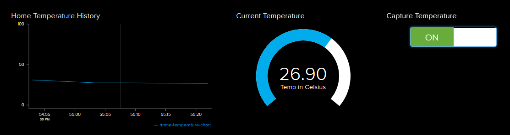

# Home IoT
Home IoT project as part of "IoT with Arduino" course

## Description
The project uses [io.adafruit.com](https://io.adafruit.com) feeds to visualize data from and control the Arduino Primo board and the connected sensors.

### [DHT-22 Sensor](https://www.robotev.com/product_info.php?cPath=1_29&products_id=304)
DHT-22 sensor is used to measure humidity and temperature that are visualized online

Sensor capturing state (ON/OFF) can be controlled from an Adafruit IO feed

### [Motion Sensor](https://www.robotev.com/product_info.php?cPath=1_29&products_id=179)
Motion sensor is used for an alarm detecting any movement or physical environment change

If any movement detected - the board starts buzzing and movement is reported online

Alarm state (ON/OFF) can be controlled from an Adafruit IO feed

